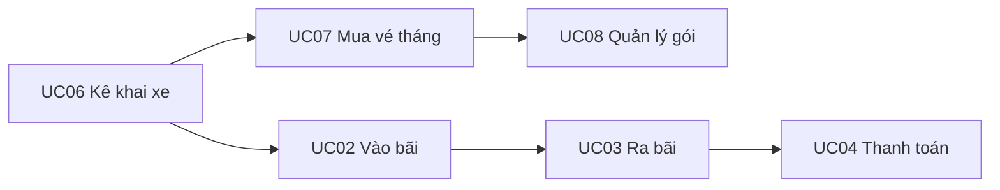

# Đặc tả Use Case — Hệ thống iPARK (v3.0)

> **27 Use Case** (UC01–UC27).  
> **Phân loại UCP:** Tất cả **27 Medium UC** (4–7 bước luồng chính).  
> **Nguyên tắc:** Vận hành **TỰ ĐỘNG** toàn diện. **Kê khai xe trước (UC06)** — mô hình vé tháng xe buýt; **mua vé tháng (UC07)** chỉ chọn biển đã kê khai; vào/ra bãi tự động.

---

## Nguyên tắc tự động hóa

| Hạng mục | Cách xử lý |
|----------|------------|
| Vào/ra bãi | AI camera tự nhận diện, tự cấp chỗ, tự mở barrier |
| Thanh toán | Tự tính phí, VietQR, đồng bộ ngân hàng |
| Thành viên | Tự kích hoạt gói sau thanh toán; gắn biển số đã kê khai (UC06) |
| Giám sát | Tự phát hiện sự cố thiết bị/AI |
| **Kê khai xe (UC06)** | **Kê khai biển số + thông tin xe một lần trước (như vé tháng xe buýt)** |
| **Mua vé tháng (UC07)** | **Chỉ chọn biển số đã kê khai — không nhập thông tin xe** |
| Staff | Chỉ khi hệ thống không tự xử lý được (UC14, UC16) |
| Admin | Cấu hình một lần; vận hành ngày tự động |

---

## Phân nhóm Actor

| Nhóm | UC |
|------|-----|
| Guest | UC01–UC04 |
| Customer | UC05–UC06, UC09–UC12 |
| Member | UC07–UC08 |
| Staff | UC13–UC16 |
| Admin | UC17–UC27 |

---

## Thống kê UCP (Transaction)

| Phân loại | Điều kiện (Main) | Số UC |
|-----------|------------------|-------|
| Simple | 1–3 | **0** |
| **Medium** | **4–7** | **27** |
| Complex | ≥8 | **0** |

| UC | Tên | Nhóm | UCP | Main | Alt | Exc | Tổng | Tự động |
|----|-----|------|-----|------|-----|-----|------|---------|
| UC01 | Tra cứu tình trạng bãi đỗ | Guest | Medium | 5 | 1 | 1 | 7 | Tự động |
| UC02 | Gửi xe vào bãi | Guest | Medium | 6 | 2 | 2 | 10 | Tự động |
| UC03 | Lấy xe ra khỏi bãi | Guest | Medium | 6 | 1 | 1 | 8 | Tự động |
| UC04 | Thanh toán phí đỗ xe | Guest | Medium | 5 | 1 | 1 | 7 | Tự động |
| UC05 | Quản lý hồ sơ cá nhân | Customer | Medium | 4 | 0 | 1 | 5 | Tự động |
| UC06 | Quản lý phương tiện | Customer | Medium | 5 | 1 | 1 | 7 | Kê khai trước |
| UC07 | Đăng ký thành viên | Member | Medium | 5 | 2 | 2 | 9 | Tự động |
| UC08 | Quản lý thành viên của tôi | Member | Medium | 5 | 0 | 1 | 6 | Tự động |
| UC09 | Xem lịch sử đỗ xe | Customer | Medium | 4 | 1 | 0 | 5 | Tự động |
| UC10 | Xem lịch sử giao dịch | Customer | Medium | 4 | 0 | 0 | 4 | Tự động |
| UC11 | Xem thông báo | Customer | Medium | 4 | 0 | 0 | 4 | Tự động |
| UC12 | Đánh giá dịch vụ | Customer | Medium | 4 | 0 | 0 | 4 | Tự động |
| UC13 | Giám sát hoạt động bãi đỗ | Staff | Medium | 4 | 1 | 0 | 5 | Tự động* |
| UC14 | Xử lý sự cố vận hành | Staff | Medium | 5 | 0 | 1 | 6 | Tự động* |
| UC15 | Quản lý ca làm việc | Staff | Medium | 4 | 0 | 0 | 4 | Tự động* |
| UC16 | Xử lý yêu cầu hỗ trợ khách hàng | Staff | Medium | 5 | 1 | 1 | 7 | Tự động* |
| UC17 | Quản lý người dùng và phân quyền | Admin | Medium | 4 | 0 | 1 | 5 | Cấu hình |
| UC18 | Quản lý biểu phí khách vãng lai | Admin | Medium | 4 | 0 | 0 | 4 | Cấu hình |
| UC19 | Quản lý gói thành viên | Admin | Medium | 4 | 0 | 0 | 4 | Cấu hình |
| UC20 | Quản lý khu vực đỗ xe | Admin | Medium | 4 | 0 | 0 | 4 | Cấu hình |
| UC21 | Quản lý vị trí đỗ xe | Admin | Medium | 4 | 0 | 0 | 4 | Cấu hình |
| UC22 | Quản lý giao dịch thanh toán | Admin | Medium | 4 | 1 | 0 | 5 | Cấu hình |
| UC23 | Quản lý thông báo | Admin | Medium | 4 | 0 | 0 | 4 | Cấu hình |
| UC24 | Quản lý sự cố vận hành | Admin | Medium | 4 | 0 | 0 | 4 | Cấu hình |
| UC25 | Xem báo cáo hoạt động và doanh thu | Admin | Medium | 4 | 0 | 0 | 4 | Cấu hình |
| UC26 | Giám sát hệ thống | Admin | Medium | 4 | 0 | 0 | 4 | Cấu hình |
| UC27 | Quản lý cấu hình hệ thống | Admin | Medium | 4 | 0 | 0 | 4 | Cấu hình |

\* Staff: hệ thống tự giám sát; nhân viên can thiệp khi cần.

**27 Medium UC:** UC01–UC27 — tất cả đều Medium.

---

## Function Details (8 chức năng vận hành)

| # | Function Details | UC | Actor |
|---|------------------|-----|-------|
| 1 | View Vehicle Entry Queue | UC13 | Staff |
| 2 | View Vehicle Exit Queue | UC13 | Staff |
| 3 | Scan QR Ticket | UC04 | Guest, Staff |
| 4 | Process Cash Payment | UC04, UC22 | Staff |
| 5 | Handle Parking Exceptions | UC14 | Staff |
| 6 | Auto Generate Parking Ticket | UC02 | Hệ thống |
| 7 | Auto Generate QR Code | UC04 | Hệ thống |
| 8 | Auto Generate Invoice | UC03, UC04, UC10 | Hệ thống |

Chi tiết đầy đủ: `docs/FUNCTION_DETAILS.md`

---

## «include» Sub-flows

| UC cha | «include» |
|--------|-----------|
| UC03 | UC04 Thanh toán phí |
| UC07 | Xem danh sách gói, Mua gói, Chọn biển đã kê khai (UC06), Thanh toán |
| UC08 | Gia hạn gói, Hủy gói, Xem trạng thái gói, Xem thời hạn |
| UC14 | AI lỗi, Mất kết nối thiết bị, Khiếu nại khẩn |
| UC19 | Tạo gói, Cập nhật gói, Ngưng áp dụng, Xem danh sách đăng ký |

---

## Luồng nghiệp vụ chính

---

## File tài liệu

| File | Mô tả |
|------|--------|
| `docs/USE_CASE_SPECIFICATION_UML.docx` | Word UML đầy đủ từng UC |
| `docs/uc_data.py` | Dữ liệu nguồn 27 UC |
| `docs/generate_uc_word.py` | Script xuất Word |

Tạo lại Word: `python docs/generate_uc_word.py`
